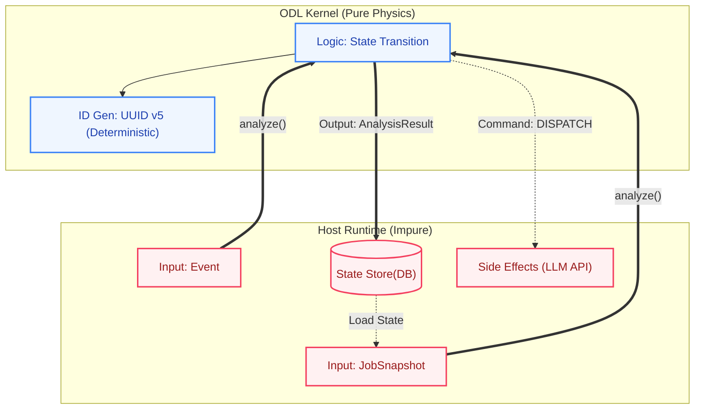

# ODL Kernel: The Physics Engine for Agents

ODL (Organizational Definition Language) Kernel is a deterministic, stateless execution engine for autonomous AI agents.

While many agent frameworks try to hide the complexity of loops and prompts behind "magic," ODL takes the opposite approach: **Organization as Code**. You define the structure in YAML, and the Kernel executes it like physics.

Think of it as **"Redux for Agents."** The Kernel has zero side effects. It takes the current state and an event, calculates the transition, and tells your Host Runtime exactly what to do next.

## 1. The Mental Model

The architecture follows the **Functional Core / Imperative Shell** pattern.

* **Kernel (Functional Core):** The laws of physics. It receives an input and returns a strictly calculated output (Next State + Commands). It manages deterministic ID generation (UUID v5) and scope resolution.
* **Host (Imperative Shell):** Your application. It handles the "dirty work" like database persistence, API calls to LLMs, and webhook handling.

**Why this matters:** Most agent frameworks fail because they mix state (memory) with side effects (LLM calls). ODL separates them, making your agents **testable, replayable, and auditable.**



## 2. Define: Organization as Data

First, declare the agent collaboration structure. This acts as the "Constitution" of your system.

```yaml
# source.yaml
# Define a team where a Manager delegates tasks to a Worker loop.
generate_team:
  generator: Product_Designer
  validators: [Sustainability_Expert]
  loop: 3
  inputs: 
    - MarketResearch
  output: ProductDesign
```

## 3. The Host Implementation (Python)

Your job is simple: implement the **"Load -> Analyze -> Apply"** loop.
The Kernel is database-agnostic. It works with PostgreSQL, Redis, or even in-memory.

### The Loop

```python
import odl
import odl_kernel
from odl_kernel.types import (
    JobSnapshot, KernelEvent, KernelEventType, CommandType
)

# 1. Compile Source (One time)
# Compiles YAML into a static execution graph (IR).
# This validates syntax and resolves syntactic sugar.
with open("source.yaml", "r") as f:
    ir_root = odl.compile(f.read())

def event_handler(job_id: str, event: KernelEvent):
    """
    Main Event Loop triggered by Webhooks or Cron.
    """
    
    # 2. Load Snapshot (Imperative)
    # Fetch current state from your DB and map to ODL entities.
    # The Kernel doesn't know about your DB schema.
    current_job, current_nodes = my_db.fetch_job_state(job_id)
    
    snapshot = JobSnapshot(
        job=current_job, 
        nodes=current_nodes
    )

    # 3. Analyze (Pure Functional)
    # This is the core. Calculates the next state without side effects.
    # The kernel is purely computational. It generates a deterministic UUID v5
    # based on the structural path, ensuring idempotency and replayability.
    result = odl_kernel.analyze(snapshot, event)

    # 4. Apply Side Effects (Imperative)
    # Apply the calculation results to the real world.

    # 4-1. Persist State (Truth)
    # Nodes with changed status (e.g., PENDING -> RUNNING).
    # ODL relies on the Host to store state. Since IDs are deterministic,
    # this operation is safe to replay (Upsert).
    my_db.bulk_upsert(result.updated_nodes)

    # 4-2. Execute Commands (Signals)
    # Execute instructions from the Kernel.
    for cmd in result.commands:
        
        if cmd.type == CommandType.DISPATCH:
            # Trigger external AI workers or APIs
            # payload: {"worker_endpoint": "..."}
            worker_api.post(cmd.target_node_id, cmd.payload)
        
        elif cmd.type == CommandType.SPAWN_CHILD:
            # Just for logging/notification (State is already saved in 4-1)
            print(f"Spawned: {cmd.payload['child_node_id']}")
            
        elif cmd.type == CommandType.FINALIZE:
            # Process completion notification
            print(f"Node Finished: {cmd.target_node_id} -> {cmd.payload['result']}")
```

## 4. What the Kernel Provides

The `AnalysisResult` returned by `analyze()` is the only output you need to handle.

### `updated_nodes` (The State)
* **What:** A list of `ProcessNode` entities whose state has changed (e.g., `PENDING`, `RUNNING`, `COMPLETED`).
* **Action:** **UPSERT** to your database. The Kernel is stateless; it relies on you to feed this state back in the next `Snapshot`.

### `commands` (The Intent)
* **What:** An ordered list of side effects to be executed.
* **Action:** **EXECUTE** them.
    * **`TRANSITION` / `FINALIZE` / `SPAWN_CHILD`**: Notifications of internal state changes. Useful for logging or triggering UI updates.
    * **`DISPATCH`**: A request to start an external process (e.g., calling an LLM API). This is the *only* command where the Host proactively drives the agent.
    * **`REQUIRE_DATA`**: A request for data resolution. The Logic Node (e.g., `iterator_init`) needs a list or value to proceed. The Host should fetch it and callback with a `DATA_RESOLVED` event.

## 5. Why use this?

* **Deterministic Identity:** Every node has a mathematically generated `UUID v5`. If you re-run the same process with the same inputs, you get the exact same IDs. Logs become persistent assets, not transient noise.
* **Resume & Replay:** Since state is isolated in the `Snapshot`, you can easily pause, resume, or replay events for debugging by simply reloading the state.
* **Separation of Concerns:** Separate your Prompt Engineering (YAML/Worker) from your State Management logic (Kernel).

**Stop managing state variables. Start defining physics.**